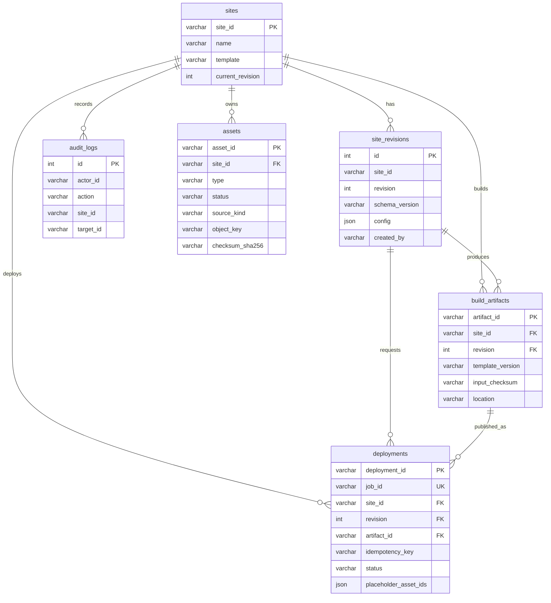

# 展站数据库设计（Phase 2）

## 范围

Phase 2 持久化站点身份、不可变配置版本、已复核素材、不可变构建产物、预览部署任务和审计记录。部署重试、回滚与完整日志仍属于 Phase 3。

## 实现来源

- Drizzle 定义：`apps/api/src/db-schema.ts`
- 基线 migration：`apps/api/drizzle/0000_phase1_baseline.sql`
- 外键 migration：`apps/api/drizzle/0001_add_site_foreign_keys.sql`
- Phase 2 migration：`apps/api/drizzle/0002_phase2_assets_and_preview.sql`
- 可靠任务 migration：`apps/api/drizzle/0003_reliable_deployment_leases.sql`
- 配置字段契约：[SiteConfig v1 Schema](../schemas/site-config-v1.schema.json)

## 数据模型

## 关键约束

- `sites.site_id` 是站点的稳定身份。
- `site_revisions` 的 `(site_id, revision)` 唯一；已创建的配置版本不可更新。
- `site_revisions.site_id` 与 `audit_logs.site_id` 通过外键引用 `sites.site_id`，禁止产生孤立记录。
- 创建 Revision 时在一个事务中锁定站点行，并比较 `expectedRevision` 与 `current_revision`；不一致时 API 返回 `409 revision_conflict`。
- `audit_logs` 记录站点与版本创建操作。
- 创建站点时在同一事务中写入 `Site`、revision 1、`site.created` 和 `revision.created` 审计。
- `assets` 只保存完成服务端复核后的不可变记录；`asset_id` 全局唯一，`object_key` 唯一并通过外键归属站点。
- `source_kind` 仅允许 `customer_provided` 或 `placeholder`；真实素材不得填写占位批准字段，未经批准的占位素材不能部署。
- `build_artifacts` 通过 `(site_id, revision)` 引用不可变 Revision；相同 revision、模板版本与输入 checksum 只产生一个记录。构建开始前先原子预留记录并取得租约，只有持有租约的 Worker 能写入 artifact 路径；构建成功后状态才变为 `ready`。
- `deployments` 的 `(site_id, idempotency_key)` 唯一；状态限于 `queued / building / deploying / healthy / failed`，并保存该 Revision 实际引用的已批准占位 Asset ID，供后台持续提示。`lease_expires_at` 允许 Worker 原子领取 queued 任务，并在进程崩溃后重新领取过期的 building/deploying 任务。
- 上传签名、Asset 复核、artifact 创建和 Deployment 创建分别写入审计；同一上传令牌重复完成时仓库返回已有 Asset，不创建重复记录。完成复核无论成功或失败都会删除临时上传对象；OSS bucket 还必须配置 `uploads/` 前缀的生命周期清理，作为 API 中断时的兜底。
- API 写入前使用与 JSON Schema 对齐的 Zod 运行时契约；数据库 JSON 字段不替代业务校验。

## MySQL 集成测试

设置独立的 `DATABASE_URL_TEST` 后运行 `pnpm --filter @zhansite/api test`。数据库名必须包含 `test`；测试会清空其中的 Phase 2 表、执行全部 migration，并验证 revision 1、乐观锁、Asset 外键、Deployment 幂等/查询、审计、多 Worker 并发领取、Deployment 租约过期恢复和 Artifact 预留/过期恢复。未设置变量时该集成测试明确跳过，不会回退使用开发数据库。

## Migration 运维与回滚

Phase 2 migration 采用追加式执行，生产或受控预览环境升级前必须备份数据库，并先在结构一致的独立测试库依次演练 `0000`～`0003`。执行后核对 `assets`、`build_artifacts`、`deployments` 表、外键、唯一索引以及 `lease_expires_at` 字段，再启动 API 和 Worker。

仓库不提供自动向下 migration。若 `0002` 或 `0003` 执行失败，应停止 API 与 Worker、保留原始错误和备份，修复后以前向 migration 恢复；不得在有业务写入后直接删除 Phase 2 表或租约字段。只有确认尚无 Phase 2 数据写入时，才可由运维人员依据备份和变更窗口人工撤销新增对象。已产生数据时回滚应用版本前，应先确认旧版本不会误读新状态；必要时保持数据库结构不变，仅停止新 Worker 并恢复应用。

## 后续扩展

Phase 3 再增加部署日志、重试关联、回滚记录和失败保护所需的指针模型。
