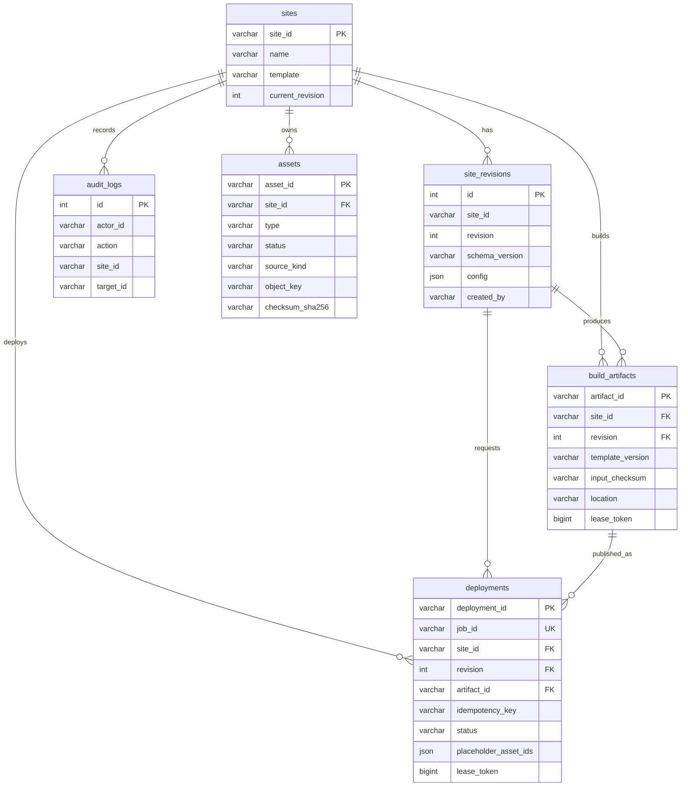

# 展站 MySQL 8 数据库设计与运维（Phase 2）

## 范围

Phase 2 持久化站点身份、不可变配置版本、已复核素材、不可变构建产物、预览部署任务和审计记录。本文同时规定 MySQL 物理结构、本机从零建库、迁移与验收契约。部署重试、回滚与完整日志仍属于 Phase 3。

## MySQL 运行契约

- 数据库产品：Oracle MySQL 8.0.16 或更高版本；不支持 MariaDB。`CHECK` 约束从 MySQL 8.0.16 起才会执行。
- 存储引擎：InnoDB。
- 数据库字符集：`utf8mb4`。
- 数据库排序规则：`utf8mb4_0900_ai_ci`。
- 应用时区：UTC。MySQL repository 使用 UTC 解析时间，迁移器把当前 session 设为 `+00:00`。
- 数据库 URL：`mysql://用户名:URL编码后的密码@主机:3306/数据库名`。
- 权威变更路径：已提交的 `apps/api/drizzle/NNNN_*.sql` 加 `_zhansite_migrations` journal。禁止直接对共享环境执行 `drizzle-kit push`。

## 实现来源

- Drizzle 定义：`apps/api/src/db-schema.ts`
- 基线 migration：`apps/api/drizzle/0000_phase1_baseline.sql`
- 外键 migration：`apps/api/drizzle/0001_add_site_foreign_keys.sql`
- Phase 2 migration：`apps/api/drizzle/0002_phase2_assets_and_preview.sql`
- 可靠任务 migration：`apps/api/drizzle/0003_reliable_deployment_leases.sql`
- 数据库可靠性 migration：`apps/api/drizzle/0004_database_reliability.sql`
- 统一迁移器：`apps/api/src/migrations.ts`、`apps/api/src/migrate.ts`
- 配置字段契约：[SiteConfig v1 Schema](../schemas/site-config-v1.schema.json)

## 本机从零建库

先在 MySQL 8 中执行：

```sql
CREATE DATABASE zhansite
  CHARACTER SET utf8mb4
  COLLATE utf8mb4_0900_ai_ci;
CREATE DATABASE zhansite_test
  CHARACTER SET utf8mb4
  COLLATE utf8mb4_0900_ai_ci;
```

PowerShell 当前会话设置（密码包含 `@`、`:`、`/` 等保留字符时必须 URL 编码）：

```powershell
$env:DATABASE_URL="mysql://用户名:密码@localhost:3306/zhansite"
$env:DATABASE_URL_TEST="mysql://用户名:密码@localhost:3306/zhansite_test"
$env:DEV_ACTOR_ID="local-operator"
```

API、Worker 和迁移命令会自动读取 `apps/api/.env`。PowerShell、IDE 启动配置或进程管理器中已存在的环境变量优先，不会被 `.env` 覆盖；共享和生产环境仍应由密钥管理系统注入。

从仓库根目录执行统一迁移和验收：

```powershell
pnpm --filter @zhansite/api db:migrate
pnpm --filter @zhansite/api test
pnpm dev:api
```

`db:migrate` 会验证 MySQL 版本、数据库字符集/排序规则，先取得数据库级命名锁（最多等待 30 秒），再按文件名执行 `0000`～最新 migration，并把文件名和 SHA-256 写入 `_zhansite_migrations`。已执行文件内容发生变化时会拒绝继续。

## 数据模型



## 物理表说明

### `sites`

- `site_id varchar(80)`：主键，站点稳定身份。
- `name varchar(100)`、`template varchar(80)`：展示名称与模板标识，均非空。
- `current_revision int`：当前 Revision 指针；正常 API 创建后从 1 开始。
- `created_at`、`updated_at timestamp`：创建与最后更新时间。

### `site_revisions`

- `id int auto_increment`：内部主键。
- `site_id varchar(80)`、`revision int`：业务版本键，唯一索引为 `(site_id, revision)`，并外键引用 `sites`。
- `schema_version varchar(20)`：配置契约版本。
- `config json`：不可变 SiteConfig 快照；JSON 业务结构由服务端 Zod/JSON Schema 校验。
- `created_by varchar(100)`、`created_at timestamp`：创建审计信息。

### `audit_logs`

- `id int auto_increment`：主键。
- `actor_id`、`action`、`site_id`、`target_id`：操作者、动作、站点和目标。
- `site_id` 外键使用 `ON DELETE RESTRICT`。
- `(site_id, created_at)` 索引服务站点审计时间线查询。

### `assets`

- `asset_id varchar(110)`：全局主键；`object_key varchar(512)` 全局唯一。
- `site_id`：所属站点外键；`type`、`status`、`source_kind` 由 `CHECK` 限定。
- 占位素材的批准人和批准时间必须同时为空或同时非空；客户素材不得填写占位批准字段。
- `size_bytes bigint unsigned`、`checksum_sha256 varchar(64)`、MIME、原文件名和受控 URL 保存复核事实。
- `(site_id, created_at)` 索引服务素材列表。

### `build_artifacts`

- `artifact_id varchar(110)`：主键。
- `(site_id, revision)`：复合外键引用 `site_revisions`。
- `template`、`template_version`、`input_checksum`：构建输入身份。
- `(site_id, revision, template_version, input_checksum)` 唯一，防止同一输入重复建档。
- `(artifact_id, site_id, revision)` 唯一键供 Deployment 复合外键引用。
- `status` 仅允许 `building / ready`；`lease_expires_at` 是租约截止时间。
- `lease_token bigint unsigned`：单调递增 fencing token；旧 Worker 的完成写入必须失败。
- `location`：不可变 artifact 对象前缀。

### `deployments`

- `deployment_id`：主键；`job_id`：全局唯一任务查询键。
- `(site_id, idempotency_key)` 唯一，提供站点级请求幂等。
- `(site_id, revision)` 外键引用 SiteRevision。
- `(artifact_id, site_id, revision)` 复合外键保证产物属于同一站点和 Revision；排队阶段 `artifact_id` 可为空。
- `environment` 仅允许 `preview`；`status` 仅允许 `queued / building / deploying / healthy / failed`。
- `placeholder_asset_ids json` 保存创建任务时引用的占位素材快照。
- `lease_expires_at` 与 `lease_token` 共同实现可恢复且可 fencing 的 Worker 领取。
- `(status, lease_expires_at, created_at)` 用于任务领取；`(site_id, created_at)` 用于站点任务列表。

所有业务外键使用 `ON UPDATE CASCADE ON DELETE RESTRICT`。Phase 2 不提供站点物理删除；需要下线或数据保留策略时应先设计软删除/归档流程。

## 关键约束

- `sites.site_id` 是站点的稳定身份。
- `site_revisions` 的 `(site_id, revision)` 唯一；已创建的配置版本不可更新。
- `site_revisions.site_id` 与 `audit_logs.site_id` 通过外键引用 `sites.site_id`，禁止产生孤立记录。
- 创建 Revision 时在一个事务中锁定站点行，并比较 `expectedRevision` 与 `current_revision`；不一致时 API 返回 `409 revision_conflict`。
- `audit_logs` 记录站点与版本创建操作。
- 创建站点时在同一事务中写入 `Site`、revision 1、`site.created` 和 `revision.created` 审计。
- `assets` 只保存完成服务端复核后的不可变记录；`asset_id` 全局唯一，`object_key` 唯一并通过外键归属站点。
- `source_kind` 仅允许 `customer_provided` 或 `placeholder`；真实素材不得填写占位批准字段，未经批准的占位素材不能部署。
- `build_artifacts` 通过 `(site_id, revision)` 引用不可变 Revision；相同 revision、模板版本与输入 checksum 只产生一个记录。构建开始前先原子预留记录并取得租约；每次领取令 `lease_token + 1`，只有携带当前 token 的 Worker 能将状态改为 `ready`。
- `deployments` 的 `(site_id, idempotency_key)` 唯一；状态限于 `queued / building / deploying / healthy / failed`，并保存该 Revision 实际引用的已批准占位 Asset ID。领取或重领任务时 `lease_token + 1`；后续状态写入以 `(job_id, lease_token)` 为条件，防止过期 Worker 覆盖新结果。
- Deployment 绑定 Artifact 时使用 `(artifact_id, site_id, revision)` 复合外键，数据库拒绝跨站点或跨 Revision 的产物关联。
- 上传签名、Asset 复核、artifact 创建和 Deployment 创建分别写入审计；同一上传令牌重复完成时仓库返回已有 Asset，不创建重复记录。完成复核无论成功或失败都会删除临时上传对象；OSS bucket 还必须配置 `uploads/` 前缀的生命周期清理，作为 API 中断时的兜底。
- API 写入前使用与 JSON Schema 对齐的 Zod 运行时契约；数据库 JSON 字段不替代业务校验。

## MySQL 集成测试

设置独立的 `DATABASE_URL_TEST` 后运行 `pnpm --filter @zhansite/api test`。数据库名必须以 `_test` 结尾；测试会清空其中的 Phase 2 表和 migration journal，通过统一迁移器执行全部 migration，并验证 revision 1、乐观锁、Asset 外键、Deployment 幂等/查询、跨站 Artifact 拒绝、审计、多 Worker 并发领取、fencing token、Artifact 首次并发预留和关键 DDL 结构。未设置变量时该集成测试明确跳过，不会回退使用开发数据库。

## Migration 运维与回滚

Phase 2 migration 采用追加式执行。生产或受控预览环境升级前必须备份数据库，并先在结构一致的独立测试库执行 `pnpm --filter @zhansite/api db:migrate`。执行后核对 `_zhansite_migrations`、外键、唯一索引、`lease_token` 和 `lease_expires_at`，再启动 API 和 Worker。

如果数据库已经人工执行过 `0000`～`0003`、但尚无 `_zhansite_migrations`，先备份并确认六张业务表与 `0003` 租约列齐全，再且仅再执行一次：

```powershell
pnpm --filter @zhansite/api db:migrate --baseline-existing
```

该命令只把 `0000`～`0003` 的当前 checksum 登记为基线，然后继续执行 `0004` 及后续 migration；结构校验不通过时拒绝基线。不得对空库使用该参数，也不得用它跳过未知结构差异。

仓库不提供自动向下 migration。MySQL DDL 不能依赖事务整体回滚：任一 migration 失败时应立即停止 API 与 Worker，保留原始错误、`_zhansite_migrations` 状态和备份，核对实际列、索引和约束后编写新的前向 migration 恢复。不得修改已登记 migration 的内容或直接伪造 checksum。只有确认尚无 Phase 2 数据写入时，才可由运维人员依据备份和变更窗口人工撤销新增对象。

## 后续扩展

Phase 3 再增加部署日志、重试关联、回滚记录和失败保护所需的指针模型。
