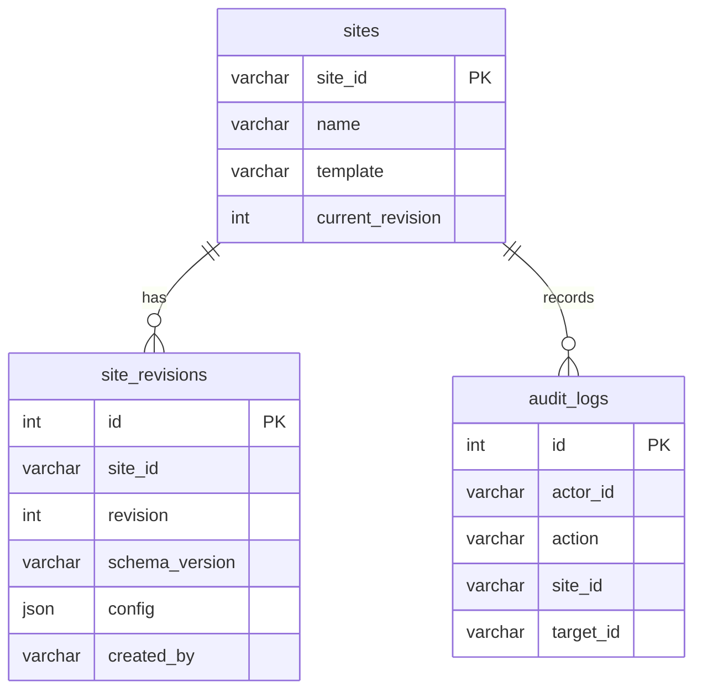

# Phase 1 数据库设计

## 范围

Phase 1 只持久化站点身份、不可变配置版本和审计记录。素材、构建产物和部署任务属于后续阶段。

## 实现来源

- Drizzle 定义：`apps/api/src/db-schema.ts`
- 基线 migration：`apps/api/drizzle/0000_phase1_baseline.sql`
- 外键 migration：`apps/api/drizzle/0001_add_site_foreign_keys.sql`
- 配置字段契约：[SiteConfig v1 Schema](../schemas/site-config-v1.schema.json)

## 数据模型

## 关键约束

- `sites.site_id` 是站点的稳定身份。
- `site_revisions` 的 `(site_id, revision)` 唯一；已创建的配置版本不可更新。
- `site_revisions.site_id` 与 `audit_logs.site_id` 通过外键引用 `sites.site_id`，禁止产生孤立记录。
- 创建 Revision 时在一个事务中锁定站点行，并比较 `expectedRevision` 与 `current_revision`；不一致时 API 返回 `409 revision_conflict`。
- `audit_logs` 记录站点与版本创建操作。
- API 写入前使用与 JSON Schema 对齐的 Zod 运行时契约；数据库 JSON 字段不替代业务校验。

## 后续扩展

Phase 2 增加 `assets`、`build_artifacts`、`deployments` 和素材归属校验；Phase 3 再增加部署日志、重试和回滚记录。
