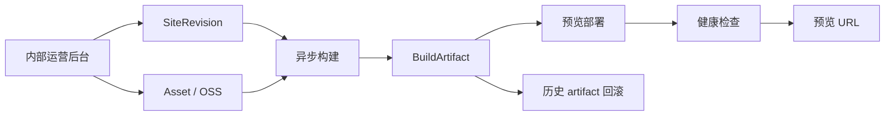

# 展站（ZhanSite）— 项目计划

| 项目 | 内容 |
|------|------|
| **文档版本** | v1.4 |
| **创建日期** | 2026-05-24 |
| **修订日期** | 2026-07-15 |
| **文档名称** | 展站计划 |
| **关联文档** | [展站 PRD](./展站-产品需求文档(PRD).md) · [金源 PRD](./jinyuan/金源电器官网-产品需求文档(PRD).md) |

---

## 1. 项目定位

**展站**是一个面向 B2B 企业的配置驱动建站与发布平台，帮助制造、贸易等公司快速做出可给客户看的 **企业展示官网**。

- **一句话**：配置生成企业展示官网
- **Slogan**：配置做站，一键展给客户
- **首个样板**：杭州金源电器（`jinyuan-mvp`）
- **V1 边界**：先做内部运营交付工具，不做客户自助 SaaS 和产品化 Agent

长期产品定位保持不变，但 V1 先验证“固定模板 + 结构化配置 + 素材上传 + 可靠预览发布”是否能降低单站交付工时。

### 1.1 解决什么问题

| 痛点 | 展站方案 |
|------|----------|
| 传统建站沟通慢、改稿贵 | 结构化配置驱动，小时级出预览；后续引入 AI 辅助采集 |
| Logo、证书、PDF 分散 | 统一内部运营后台上传管理 |
| 预览与正式上线流程割裂 | 同一静态包，先预览后 promote |
| 销售缺少微信可发的门面 | 纯静态站 + HTTPS + 移动端适配 |

### 1.2 V1 不做什么

- 通用任意类型网站（博客、电商、社区）
- 复杂 CMS、在线商城
- 客户自助账号与多角色协作
- 产品化 Agent 对话入口
- 客户正式域名、客户 DNS 与客户 ICP 备案流程（平台预览域名的 DNS、证书与合规配置仍属于 V1 前置条件）

---

## 2. 系统拆分（四块架构）

长期目标拆为四个模块。V1 仅实现配置/模板、内部运营后台、素材与预览部署；Agent 产品化后置。

```
┌─────────────┐     ┌─────────────┐     ┌─────────────┐     ┌─────────────┐
│  ① Agent    │────▶│ ② 代码生成   │────▶│  ③ 展示     │     │ ④ SaaS 后台 │
│  多轮对话    │     │ 模板+config  │     │  粗预览     │◀───▶│ 上传+部署   │
└─────────────┘     └─────────────┘     └─────────────┘     └─────────────┘
       │                   │                   │                   │
       └───────────────────┴───────────────────┴───────────────────┘
                                    │
                      SiteRevision + Asset
                  （版本化服务端校验、不可变版本）
```

V1 数据主线：

```
内部运营后台 → SiteRevision → BuildArtifact → Deployment → 预览 URL
                    ↑
              Asset（OSS URL）
```

### 2.1 ① Agent — 多轮对话与需求提取

**定位**：类似 Cursor 的垂直 Agent，但不是通用 IDE，而是 **「B2B 建站专用 Copilot」**。

| 该做 | 不该做 |
|------|--------|
| 多轮采集：行业、页面、联系方式、产品大类、品牌色 | 自由生成任意网站架构 |
| 输出结构化 SiteConfig 草稿 / PRD 摘要 | 包办 OSS 上传、备案 |
| 辅助生成文案初稿（需人工确认） | 每次从零写整站代码 |
| 引导用户到 SaaS 上传 Logo / 证书 | 替代 SaaS 的发布与部署 |

**与 Cursor 的对应**：

| Cursor | 展站 Agent |
|--------|------------|
| Chat | 需求访谈对话 |
| Agent 改代码 | **弱化** → 改 config + 调生成器 |
| 无 Deploy | 触发 SaaS 发布接口 |

**产品化路径**：内部可先用 Cursor Agent 交付；正式产品为自研对话 + 固定 10 问表单 + LLM 填槽。

---

### 2.2 ② 代码生成 — 模板 + 配置

**定位**：**确定性流水线**，V1 由运营后台触发；后续 Agent 也不能主导结构。

```
SiteRevision + 模板版本 → build → BuildArtifact（静态包）
```

| 原则 | 说明 |
|------|------|
| 固定模板 | V1 仅 B2B 制造展示站（源自 `jinyuan-mvp`） |
| 配置驱动 | 公司名、产品、资质、联系方式等全在 SiteRevision |
| LLM 边界 | 只生成文案字段，不生成页面结构 |
| 产出物 | 与 revision、模板版本绑定的不可变 BuildArtifact |

**技术栈**：Vite + React + TypeScript + React Router（与现有 MVP 一致）。

---

### 2.3 ③ 展示 — V1 预览与后续正式环境

**定位**：让用户 **看见站长大什么样**。分两层，不可混为一谈。

| 类型 | 场景 | 实现 |
|------|------|------|
| **编辑预览** | 运营后台编辑时 | 可选 iframe，读取尚未发布的配置草稿 |
| **V1 预览交付** | 销售发微信、客户确认 | revision 真实 build 后部署到 `https://{siteId}.preview.{platformDomain}` |
| **正式交付（后续）** | 绑定客户域名 | 复用健康 artifact，单独设计生产发布流程 |

**关键**：粗展示与正式预览 **共用同一套模板**，不要单独做第三套前端。

预览和正式都是静态网站，但权限、域名、合规、发布审批和回滚策略不同，正式环境不属于 V1。

---

### 2.4 ④ 内部运营后台与服务端

**定位**：产品 **长期底座**；Agent 与生成均依赖它。

| 能力 | 说明 |
|------|------|
| 站点管理 | 每客户一个 `siteId`，V1 仅内部运营账号可写 |
| 上传中心 | Logo、微信码、证书、PDF → OSS 直传 |
| 配置版本 | SiteRevision + schemaVersion，历史版本不可变；不引入 Tenant |
| 构建触发 | 异步任务：revision → artifact → preview |
| 发布可靠性 | jobId、幂等重试、健康检查、日志与回滚 |
| 审计 | 所有写操作记录 actor、siteId、目标与时间 |

API 按资源和任务语义设计，不以接口数量作为简化目标：

| 方法 | 路径 | 说明 |
|------|------|------|
| GET/POST | `/sites` | 查询 / 创建站点 |
| GET | `/sites/:id` | 站点详情与当前 revision |
| POST | `/sites/:id/revisions` | 创建不可变配置 revision |
| GET | `/sites/:id/revisions` | 查询版本历史 |
| POST | `/sites/:id/upload/sign` | OSS 直传签名 |
| POST | `/sites/:id/assets/complete` | 复核并登记素材 |
| POST | `/sites/:id/deployments` | 创建预览部署，返回 jobId |
| GET | `/sites/:id/deployments/:jobId` | 查询任务状态与日志摘要 |
| POST | `/sites/:id/deployments/:jobId/retry` | 使用幂等键重试失败任务 |
| POST | `/sites/:id/rollback` | 切换到历史健康 artifact |
| GET/POST | `/sites/:id/reviews` | 查询或新增预览审核留痕 |

**生成的企业官网本身无后端**；SaaS 只服务「做站工具」，不嵌入客户站点。

---

## 3. 数据流与中枢

### 3.1 内容事实来源：SiteRevision

V1 由内部运营后台创建 SiteRevision；生成器只读取已通过版本化服务端校验的不可变 revision。素材、构建产物和部署状态分别存储，不写回配置快照。

```yaml
schemaVersion: "1.0"
siteId: jinyuan-20260524
revision: 3
template: b2b-manufacturing-v1
templateVersion: "1.0.0"

brand:      # 公司名、主色、标语
contact:    # 电话、地址、微信素材 ID
assets:     # Logo、证书、PDF 的 assetId
home:       # 首页 Banner、理念、优势与精选分类
products:   # 分类、系列与产品素材引用
certifications: # 资质分组与证书引用
about:      # 企业介绍、理念与行业
```

字段约束、完整示例和迁移规则以 [展站 PRD 的 SiteConfig v1 契约](./展站-产品需求文档(PRD).md#53-siteconfig-v1-内容契约) 与 [机器可读 Schema](./schemas/site-config-v1.schema.json) 为唯一事实来源。

部署状态单独使用 `queued / building / deploying / healthy / failed`；域名与备案为后续独立状态维度。

### 3.2 端到端流程



---

## 4. 交付边界

| 阶段 | 交付物 | 技术本质 |
|------|--------|----------|
| **V1 预览交付** | HTTPS 链接、二维码、revision、artifact、部署日志 | 静态 artifact 部署到平台 preview 环境 |
| **V1 可靠性** | 失败重试、健康检查、历史版本回滚 | 原子切换，不破坏上一健康版本 |
| **正式域名上线（后续）** | 客户域名、生产发布、DNS 与合规流程 | 另行评审，不进入 V1 工期和验收 |

---

## 5. 技术选型

| 层级 | 选型 | 说明 |
|------|------|------|
| Monorepo | pnpm workspace | 管理 apps、templates 与共享 packages；V1 不引入 Turborepo |
| 站点模板 | Vite + React + TypeScript + React Router + Tailwind CSS | 目标模板栈；`jinyuan-mvp` 已验证 Vite + React 原型，但当前使用自定义 CSS，是否迁移 Tailwind 需在 Phase 1 决定 |
| 管理后台 | React + Vite + Tailwind CSS + Ant Design | Tailwind 负责布局与样式；与模板共享 `site-config` 类型 |
| API | Hono + TypeScript + Zod | 标准 HTTP Server；按业务域分层并集中处理鉴权、错误与审计 |
| API 运行环境 | 阿里云函数计算 Web 函数（自定义运行时） | 不依赖第三方 Hono-FC 适配器，保留容器迁移能力 |
| 异步任务 | TypeScript Worker + FC + 轻量消息队列（原 MNS） | 队列触发 artifact 组装、健康检查与部署 |
| 对象存储 | 阿里云 OSS + CDN | 素材、配置快照、artifact、日志 |
| 预览部署 | OSS 静态托管 + CDN | V1 仅平台 preview 环境；正式发布架构在后续阶段评审 |
| 元数据 | 阿里云 RDS MySQL + Drizzle ORM | 事务与条件更新；保存 Site、Revision、Asset、Deployment、ReviewRecord、AuditLog |
| 身份认证 | 阿里云 IDaaS EIAM + OIDC 授权码模式 | 托管内部账号与登录；应用执行 site scope 授权 |
| 配置校验 | Zod + TypeScript 类型推导 | 前端、API、Worker 与模板共享 `site-config` |
| 日志 | 阿里云日志服务 SLS | API、Worker、部署与安全日志 |
| 测试与质量 | Vitest + Testing Library + Playwright + ESLint + Prettier | CI 执行类型检查、lint、test 与 build |
| Agent（后续） | Cursor（内部）→ 自研对话 | 只创建配置草稿，不绕过发布流程 |

### 5.1 国内 vs 快速验证

| 场景 | 建议 |
|------|------|
| 先验证流程、内部 demo | 本地 Demo 或阿里云测试环境，保持与 V1 部署链路一致 |
| 客户在国内、微信为主 | 直接阿里云 OSS + FC + CDN |

---

## 6. 落地顺序

| 阶段 | 内容 | 验证目标 | 状态 |
|------|------|----------|------|
| **Phase 0：基线核验** | 核验金源源码、设计资产与生产构建 | 确认已有源码可复用，遗留资产与测试已登记 | 已完成（遗留项已登记） |
| **Phase 1：配置与版本** | SiteConfig v1 配置契约、SiteRevision、固定模板 | 同一输入生成一致站点，历史版本不可修改 | 已完成（遗留项已登记） |
| **Phase 2：素材与预览** | 内部后台、OSS 直传、异步构建、HTTPS 预览 | 运营人员用经复核的真实或明确批准的占位素材独立完成一次标准预览交付 | 实施中（云资源与真实素材待确认） |
| **Phase 3：可靠性** | 日志、健康检查、幂等重试、artifact 回滚 | 部署失败不影响上一健康版本 | 待做 |
| **Phase 4：正式发布** | 生产环境、域名、DNS、备案 | 单独评审，不属于 V1 | 后续 |
| **Phase 5：Agent 产品化** | 对话采集 → 配置草稿 → 人工确认 | 单独验证需求与成本，不属于 V1 | 后续 |

### 6.1 文档扩展触发条件

- 初始化平台 monorepo 时，从 PRD 技术章节抽出 `docs/guides/TECH_STACK.md` 与 `docs/guides/DEV_GUIDE.md`；
- 首次完成真实预览部署流水线时，补充 `docs/guides/DEPLOYMENT.md`（策略）与 `deploy/README.md`（实际命令）；
- 出现跨模块开发任务时，引入轻量 `.doc/specs/active/` 与 `.doc/specs/archive/`，用于临时 spec、plan 与任务记录；
- 在此之前，避免把 PRD 已覆盖的 API、数据库、测试或部署内容拆成多份长期文档。

**原则**：Agent 放后面。V1 的主用户是内部运营人员，不引入客户账号、多角色协作、正式域名或备案状态。

---

## 7. 当前进展

### 7.1 当前可确认资产

- [x] 展站 PRD（`docs/展站-产品需求文档(PRD).md`）
- [x] 展站项目计划（本文档）
- [x] 金源电器 B2B 官网 MVP 源码与构建结果（外部路径 `C:\Users\Pan\Desktop\jinyuan-mvp`；2026-07-15 已通过 `npm run build`）
- [x] 配置驱动 Demo 与管理后台 Demo（位于 `jinyuan-mvp`，采用 localStorage / Base64 / 模拟发布，仅作原型）
- [x] 金源 PRD、设计规范、首页文案与规划摘要（`docs/jinyuan/`）
- [x] Phase 1 pnpm monorepo 基线（`apps/admin`、`apps/api`、`packages/site-config`、`templates/b2b-manufacturing-v1`）
- [x] SiteConfig Zod 契约、Phase 1 MySQL migration、最小 Hono API 与金源模板构建验证
- [x] Spec 文档治理基线（ADR、活跃/归档目录、变更模板与 Cursor 规则）
- [x] Phase 1 hardening：契约一致性、开发身份边界、MySQL 错误/外键、Revision 模板输入与后台版本历史
- [x] Phase 2 本地实现基线：Asset 分级校验、短时上传、服务端文件复核、不可变 artifact、部署任务、后台冲突恢复与交互测试
- [x] 金源 Logo、PDF、产品图、证书、二维码与厂房图素材清单（当前全部待确认）
- [ ] 金源 PDF、Logo、产品图、证书图、二维码、厂房图与 Canvas 视觉稿的真实文件或逐项批准占位（待补齐）
- [ ] 受控 OSS、平台预览域名、泛域名 DNS/证书及真实 HTTPS 预览验收（待配置）
- [ ] `jinyuan-mvp` 的自动化测试与 CI（待补齐）

旧文档中“Demo 已完成”的表述已部分核验：模板和 Demo 可构建，但不等于平台能力已完成。二进制素材、PDF 死链、自动化测试与 CI 作为已登记遗留项，不阻塞 Phase 1 的配置契约开发；素材与 PDF 在 Phase 2 退出前必须补齐或明确批准占位方案，测试与 CI 在 Phase 3 退出前必须补齐。

### 7.2 若找回旧 Demo，需重点核验的差异

| 旧设计陈述 | V1 要求 |
|------------|----------|
| localStorage 配置 | 数据库存 Site / Revision 元数据，对象存储保留配置快照 |
| 浏览器 Base64 图片 | OSS 直传、短时签名、完成复核与 Asset 记录 |
| 模拟 URL 与状态 | 真实异步任务、artifact、HTTPS、健康检查和日志 |
| 单一发布状态 | 内容、部署、域名、备案状态正交拆分 |

---

## 8. 风险与边界

| 风险 | 缓解 |
|------|------|
| 旧 Demo 或模板无法找回/运行 | Phase 0 实际安装、测试和 build 后再估算 |
| 配置、素材与部署状态相互覆盖 | 使用不可变 Revision / Asset / Artifact 与独立 Deployment |
| 异步任务重复或中断 | 幂等键、任务日志、健康检查与原子回滚 |
| 模板过度定制 | V1 仅 1 套；拒绝 scope creep |
| 国内备案延迟 | V1 仅承诺平台预览域名，正式发布单独立项 |
| 素材不齐 | 占位图 + 待办清单 |

---

## 9. 对外介绍（1 分钟稿摘要）

很多 B2B 企业销售拜访时，缺少正式、专业、能发微信的官网。展站通过 **结构化配置采集需求** + **统一后台上传素材**，快速生成 **B2B 展示官网**（首页、产品、资质、关于、联系）。支持 **预览链接** 确认后再 **正式域名上线**。不做商城、不做复杂 CMS，专注 **能拿出去展示的企业门面**。AI 对话采集属于后续能力。

---

## 10. 下一步行动

1. **闭环 Phase 0 剩余项** — 补齐或明确豁免 PDF、图片、二维码、Canvas 视觉稿；为现有模板加最小 smoke test 与 CI
2. **定稿 SiteConfig v1** — 配置契约、字段限制、schemaVersion、服务端校验与迁移原则
3. **定义核心实体** — Site、SiteRevision、Asset、BuildArtifact、Deployment、ReviewRecord、AuditLog
4. **搭建内部运营 MVP** — 配置、上传、异步预览发布、日志、重试与回滚
5. **采集真实指标** — 单站工时、部署耗时、修改轮次、首版确认率与托管成本

---

## 修订记录

| 版本 | 日期 | 说明 |
|------|------|------|
| v1.0 | 2026-05-24 | 初稿，汇总架构讨论与落地计划 |
| v1.1 | 2026-07-14 | 与 PRD v1.1 对齐：收敛内部运营 V1，修正进度与阶段口径 |
| v1.2 | 2026-07-15 | 记录 Phase 0 核验结果，修正金源资产状态与下一步行动 |
| v1.3 | 2026-07-15 | 定稿 V1 技术栈，并明确 Hono Web 函数、IDaaS、MNS 与 SLS |
| v1.4 | 2026-07-15 | 统一平台域名、V1 Agent 边界、Schema 来源与 Phase 遗留项 |

---

*文档结束*
